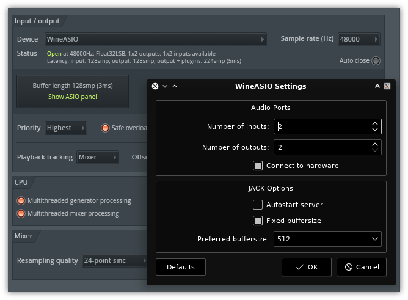

# WineASIO

WineASIO provides an ASIO to JACK driver for WINE.  
ASIO is the most common Windows low-latency driver, so is commonly used in audio workstation programs.

You can, for example, use with FLStudio under GNU/Linux systems (together with JACK).



For best results with Debian-based distributions,
enable the [KXStudio repositories](https://kx.studio/Repositories) and install WineASIO from there.

### BUILDING

Do the following to build for 32-bit Wine.

```sh
make 32
```

Do the following to build for 64-bit Wine.

```sh
make 64
```

### INSTALLING

To install 32-bit WineASIO (substitute with the path to the 32-bit wine libs for your distro).

```sh
sudo cp build32/wineasio32.dll /usr/lib/i386-linux-gnu/wine/i386-windows/
sudo cp build32/wineasio32.dll.so /usr/lib/i386-linux-gnu/wine/i386-unix/
```

To install 64bit WineASIO (substitute with the path to the 64-bit wine libs for your distro).

```sh
sudo cp build64/wineasio64.dll /usr/lib/x86_64-linux-gnu/wine/x86_64-windows/
sudo cp build64/wineasio64.dll.so /usr/lib/x86_64-linux-gnu/wine/x86_64-unix/
```

**NOTE:**  
**Wine does not have consistent paths between different Linux distributions, these paths are only a hint and likely not what will work for you.**  
**New versions of wine might also need to use `wineasio64.so` as name instead of `wineasio64.dll.so`.**  
**It is up to the packager to figure out what works for the Wine version used on their specific distro.**

#### EXTRAS

For user convenience a `wineasio-register` script is included in this repo, if you are packaging WineASIO consider installing it as part of WineASIO.

Additionally a control panel GUI is provided in this repository's `gui` subdir, which requires PyQt6 or PyQt5 to build and run.  
The WineASIO driver will use this GUI as the ASIO control panel.

### REGISTERING

After building and installing WineASIO, we still need to register it on each Wine prefix.  
For your convenience a script is provided on this repository, so you can simply run:

```sh
wineasio-register
```

to activate WineASIO for the current Wine prefix.

#### CUSTOM WINEPREFIX

The `wineasio-register` script will register the WineASIO driver in the default Wine prefix `~/.wine`.  
You can specify another prefix like so:

```sh
env WINEPREFIX=~/asioapp wineasio-register
```

### GENERAL INFORMATION

ASIO apps get notified if the jack buffersize changes.

WineASIO can slave to the jack transport.

WineASIO can change jack's buffersize if so desired. Must be enabled in the registry, see below.

The configuration of WineASIO is done with Windows registry (`HKEY_CURRENT_USER\Software\Wine\WineASIO`).  
All these options can be overridden by environment variables.  
There is also a GUI for changing these settings, which WineASIO will try to launch when the ASIO "panel" is clicked.

The registry keys are automatically created with default values if they doesn't exist when the driver initializes.
The available options are:

#### [Number of inputs] & [Number of outputs]
These two settings control the number of jack ports that WineASIO will try to open.  
Defaults are 16 in and 16 out.  Environment variables are `WINEASIO_NUMBER_INPUTS` and `WINEASIO_NUMBER_OUTPUTS`.

#### [Autostart server]

Defaults to off (0), setting it to 1 enables WineASIO to launch the jack server.  
See the jack documentation for further details.  
The environment variable is `WINEASIO_AUTOSTART_SERVER`, and it can be set to on or off.

#### [Connect to hardware]
Defaults to on (1), makes WineASIO try to connect the ASIO channels to the physical I/O ports on your hardware.  
Setting it to 0 disables it.  
The environment variable is `WINEASIO_CONNECT_TO_HARDWARE`, and it can be set to on or off.

#### [Fixed buffersize]
Defaults to on (1) which means the buffer size is controlled by jack and WineASIO has no say in the matter.  
When set to 0, an ASIO app will be able to change the jack buffer size when calling CreateBuffers().  
The environment variable is `WINEASIO_FIXED_BUFFERSIZE` and it can be set to on or off.

#### [Preferred buffersize]
Defaults to 1024, and is one of the sizes returned by `GetBufferSize()`, see the ASIO documentation for details.  
Must be a power of 2.

The other values returned by the driver are hardcoded in the source,  
see `ASIO_MINIMUM_BUFFERSIZE` which is set at 16, and `ASIO_MAXIMUM_BUFFERSIZE` which is set to 8192.  
The environment variable is `WINEASIO_PREFERRED_BUFFERSIZE`.

Be careful, if you set a size that isn't supported by the backend, the jack server will most likely shut down,
might be a good idea to change `ASIO_MINIMUM_BUFFERSIZE` and `ASIO_MAXIMUM_BUFFERSIZE` to values you know work on your system before building.

In addition there is a `WINEASIO_CLIENT_NAME` environment variable,
that overrides the JACK client name derived from the program name.

### CHANGE LOG

#### 1.3.0
* 24-JUL-2025: Make GUI settings panel compatible with PyQt6 or PyQt5
* 17-JUL-2025: Load libjack.so.0 dynamically at runtime, removing build dep
* 17-JUL-2025: Remove useless -mnocygwin flag
* 28-JUN-2025: Remove dependency on asio headers

#### 1.2.0
* 29-SEP-2023: Fix compatibility with Wine > 8
* 29-SEP-2023: Add wineasio-register script for simplifying driver registration

#### 1.1.0
* 18-FEB-2022: Various bug fixes (falkTX)
* 24-NOV-2021: Fix compatibility with Wine > 6.5

#### 1.0.0
* 14-JUL-2020: Add packaging script
* 12-MAR-2020: Fix control panel startup
* 08-FEB-2020: Fix code to work with latest Wine
* 08-FEB-2020: Add custom GUI for WineASIO settings, made in PyQt5 (taken from Cadence project code)

#### 0.9.2
* 28-OCT-2013: Add 64-bit support and some small fixes

#### 0.9.1
* 15-OCT-2013: Various bug fixes (JH)

#### 0.9.0
* 19-FEB-2011: Nearly complete refactoring of the WineASIO codebase (asio.c) (JH)

#### 0.8.1
* 05-OCT-2010: Code from Win32 callback thread moved to JACK process callback, except for bufferSwitch() call.
* 05-OCT-2010: Switch from int to float for samples.

#### 0.8.0
* 08-AUG-2010: Forward port JackWASIO changes... needs testing hard. (PLJ)

#### 0.7.6
* 27-DEC-2009: Fixes for compilation on 64-bit platform. (PLJ)

#### 0.7.5
* 29-Oct-2009: Added fork with call to qjackctl from ASIOControlPanel(). (JH)
* 29-Oct-2009: Changed the SCHED_FIFO priority of the win32 callback thread. (JH)
* 28-Oct-2009: Fixed wrongly reported output latency. (JH)

#### 0.7.4
* 08-APR-2008: Updates to the README.TXT (PLJ)
* 02-APR-2008: Move update to "toggle" to hopefully better place (PLJ)
* 24-MCH-2008: Don't trace in win32_callback.  Set patch-level to 4. (PLJ)
* 09-JAN-2008: Nedko Arnaudov supplied a fix for Nuendo under WINE.

#### 0.7.3
* 27-DEC-2007: Make slaving to jack transport work, correct port allocation bug. (RB)

#### 0.7
* 01-DEC-2007: In a fit of insanity, I merged JackLab and Robert Reif code bases. (PLJ)

#### 0.6
* 21-NOV-2007: add dynamic client naming (PLJ)

#### 0.0.3
* 17-NOV-2007: Unique port name code (RR)

#### 0.5
* 03-SEP-2007: port mapping and config file (PLJ)

#### 0.3
* 30-APR-2007: corrected connection of in/outputs (RB)

#### 0.1
* ???????????: Initial RB release (RB)

#### 0.0.2
* 12-SEP-2006: Fix thread bug, tidy up code (RR)

#### 0.0.1
* 31-AUG-2006: Initial version (RR)

### LEGAL STUFF

Copyright (C) 2006 Robert Reif  
Portions copyright (C) 2007 Ralf Beck  
Portions copyright (C) 2007 Johnny Petrantoni  
Portions copyright (C) 2007 Stephane Letz  
Portions copyright (C) 2008 William Steidtmann  
Portions copyright (C) 2010 Peter L Jones  
Portions copyright (C) 2010 Torben Hohn  
Portions copyright (C) 2010 Nedko Arnaudov  
Portions copyright (C) 2011 Christian Schoenebeck  
Portions copyright (C) 2013 Joakim Hernberg  
Portions copyright (C) 2020-2023 Filipe Coelho  

The WineASIO library code is licensed under LGPL v2.1, see COPYING.LIB for more details.  
The WineASIO settings UI code is licensed under GPL v2+, see COPYING.GUI for more details.  
